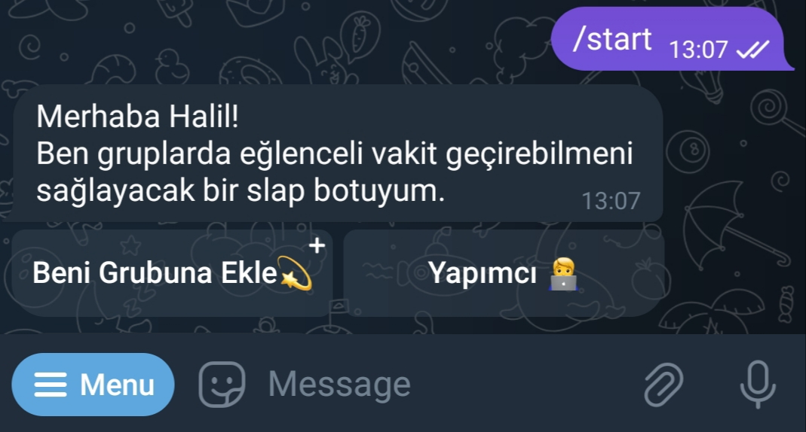
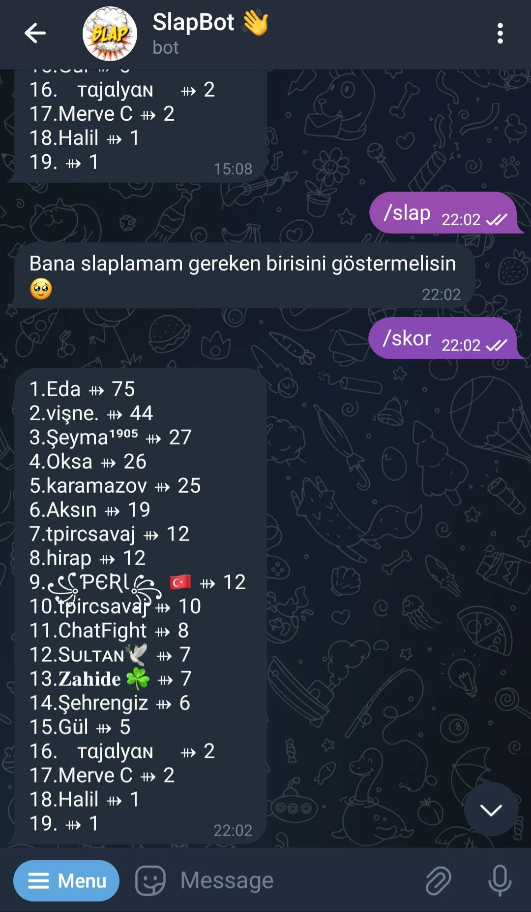
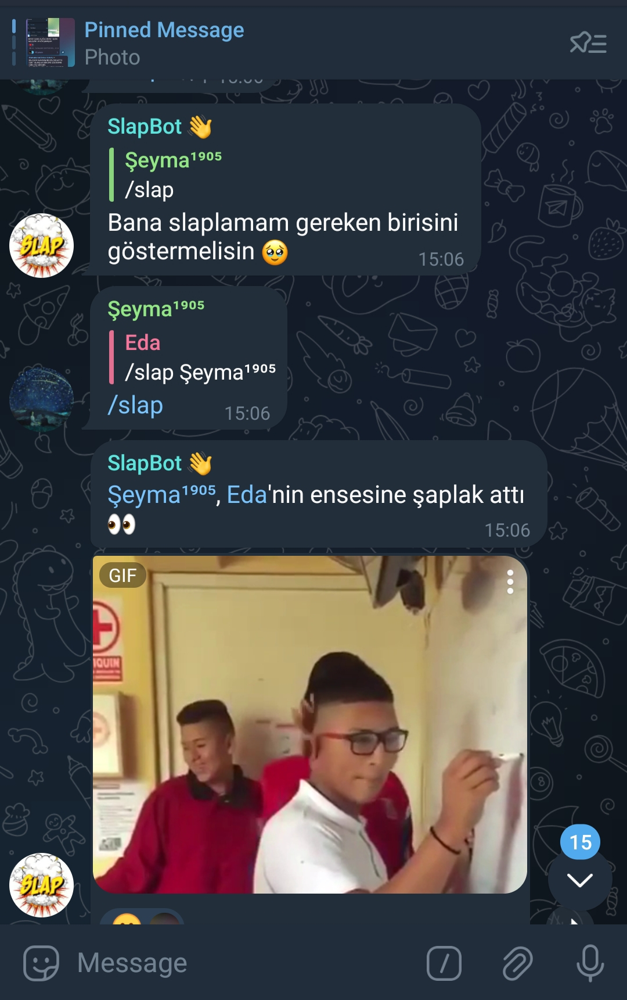

# 🔴 Botu Başlatma

<b>config.json dosyasını ayarlayınız!</b>

## 🔴 Gerekli modülleri indir
```bash
$ pip install -r requirements.txt
```

## 🔴 Scripti çalıştır
``` bash
$ python slapbot.py
```
> /start komutu




>/slap ve /skor komutu





> Bu repo [slap bot](https://t.me/slapci_bot)'un bir kopyasıdır.


